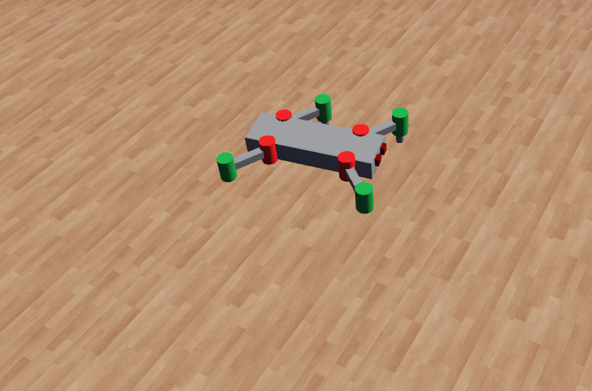

# Robot Control with Deep Q-Network



This project demonstrates a robot controlled by a Deep Q-Network (DQN) for learning locomotion with respect to a given sensor's readings. The code uses a simulated environment provided by Webots.

## Project Structure

- **controllers/drive_robot/**
  - `drive_robot.py`: Main controller script that implements the DQN agent and training loop.
  - `robot_desc.py`: Contains the definition of the robot class with sensor and actuator configurations.

- **worlds/**
  - `world.wbt`: Webots world file where the simulation environment is defined.
  - `.world.jpg`: An image possibly showing the world setup.

## Setup Instructions

### Prerequisites

- **Python 3.x**
- **Webots** (Simulation environment):
  - Download and install Webots from [official Webots website](https://cyberbotics.com/).

### Installation

1. **Install Required Python Packages:**
   ```sh
   pip install numpy torch pandas